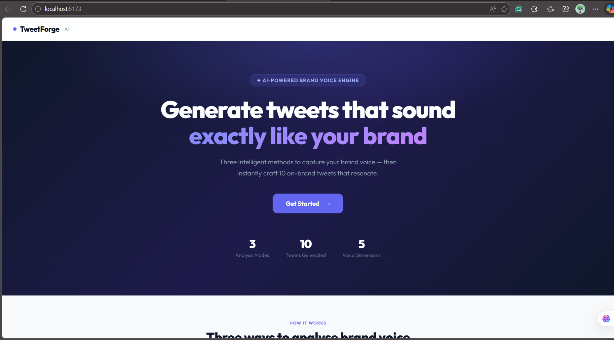
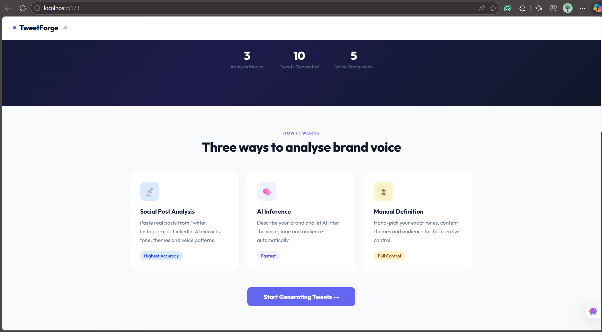
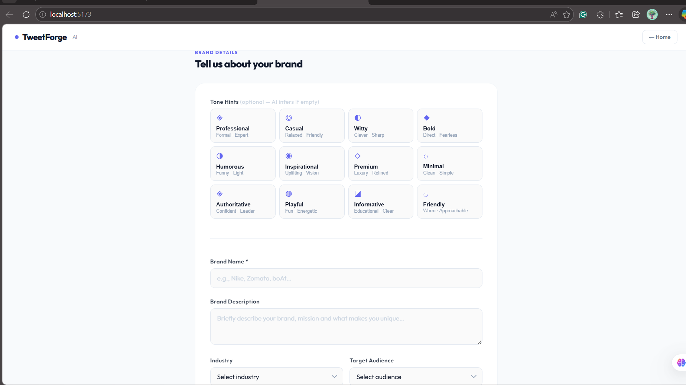
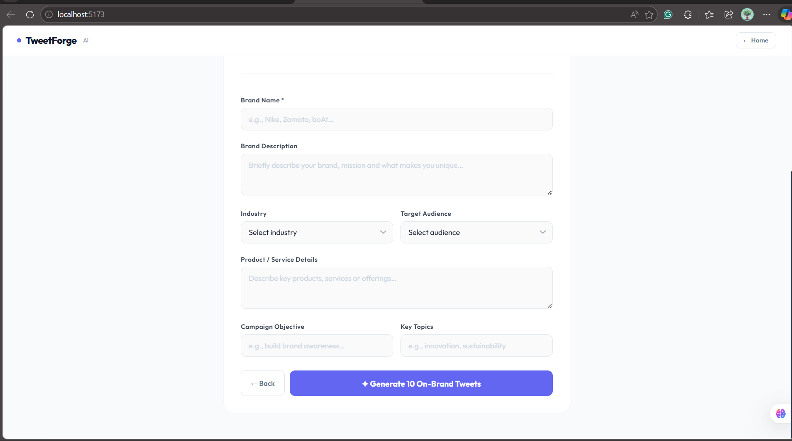
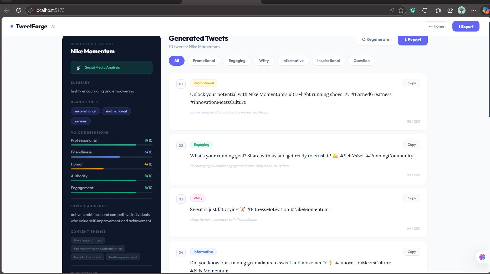
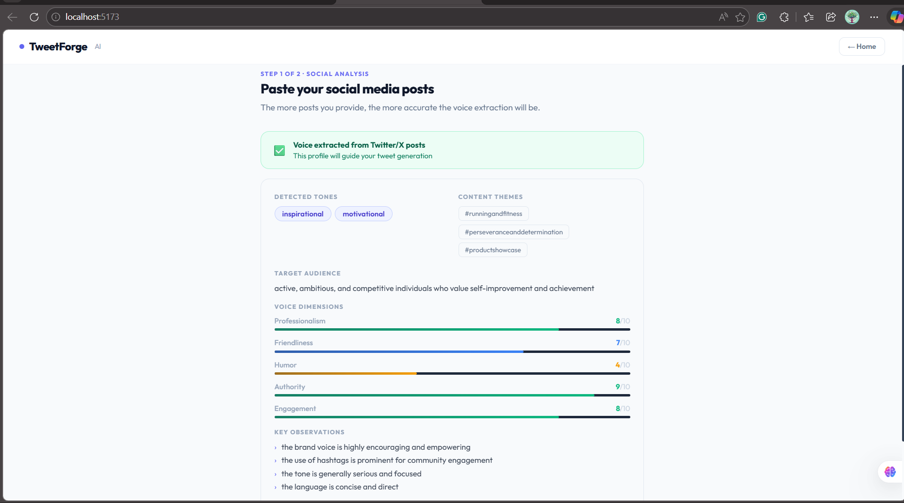

# TweetForge AI 🐦✨

> An AI-powered social content generator that creates on-brand posts using 3 intelligent voice analysis methods.

🔗 **Live Demo:** [https://tweetforge-ai.vercel.app](https://tweetforge-ai.vercel.app/)  
📁 **GitHub:** [https://github.com/Brijuval/tweetforge-ai](https://github.com/Brijuval/tweetforge-ai)

---

## 📌 What It Does

TweetForge takes your brand details, analyzes your brand voice, and generates **10 on-brand social posts** in multiple styles (promotional, engaging, witty, informative, inspirational, and question-style).

You can now choose a target platform before generation:
- Twitter/X
- LinkedIn
- Instagram

---

## 🆕 What's New (June 2026)

- Added a more professional landing experience with feature highlights, testimonials, how-it-works flow, and footer links.
- Added multi-platform generation support for Twitter/X, LinkedIn, and Instagram.
- Added tweet history with local storage persistence for completed generations (brand + timestamp).
- Added history actions: restore form state, regenerate from history, delete individual entries, and clear-all with confirmation.
- Added `Copy All` to copy all generated posts in one click, while preserving per-post copy and export.
- Improved error handling with clearer API errors, retry action, and loading skeletons.
- Refined UI polish with responsive breakpoints, icon accents, and micro-interactions.
- Refactored codebase to separate logic and UI into dedicated modules (`constants`, `lib`, `utils`, `components`).

---

## 🧠 Three Brand Voice Analysis Methods

| Method | How it works | Best for |
|--------|-------------|----------|
| 📡 Social Post Analysis | Paste real posts — AI extracts tone, themes, voice patterns | Existing brands with content |
| 🧠 AI Inference | Describe your brand — AI infers everything automatically | New brands or quick testing |
| 🎛 Manual Definition | Hand-pick tones, themes, audience yourself | Full creative control |

---

## ✨ Features

- **Professional Landing Page** — Hero, feature highlights, testimonials, how-it-works flow, and polished footer
- **Brand Voice Analysis** — 5-dimension scoring (Professionalism, Friendliness, Humor, Authority, Engagement)
- **10 Post Mix** — Promotional, Engaging, Witty, Informative, Inspirational, Question
- **Platform-aware Generation** — Optimized prompting for Twitter/X, LinkedIn, and Instagram
- **Filter by Style** — View tweets by category
- **Tweet History** — Saves completed generation results to `localStorage` with brand name and timestamp
- **History Actions** — Restore form, regenerate output, delete one item, or clear all with confirmation
- **Copy & Export** — Copy individual tweets, copy all 10 at once, or export full report as `.txt`
- **Regenerate** — Instantly re-generate with same brand settings
- **Better Error Handling** — Specific API errors, retry action, and loading skeletons
- **Responsive UI** — Works on desktop and mobile

---

## 🛠 Tech Stack

| Layer | Technology |
|-------|-----------|
| Frontend | React 18 + Vite |
| Styling | Modular CSS (`src/tweetforge.css` for global + component styles) |
| AI Model | Groq API — LLaMA 3.3 70B |
| Architecture | Separated modules (constants, API/lib, utils, UI components) |
| Fonts | Outfit + Lora (Google Fonts) |
| Deployment | Vercel (free) |

---

## 🚀 Getting Started Locally

### Prerequisites
- Node.js 18+
- Groq API key (free at [console.groq.com](https://console.groq.com))

### Installation

```bash
# Clone the repo
git clone https://github.com/Brijuval/tweetforge-ai.git
cd tweetforge-ai

# Install dependencies
npm install

# Create .env file
echo "VITE_GROQ_API_KEY=your_key_here" > .env

# Start dev server
npm run dev
```

Open [http://localhost:5173](http://localhost:5173)

Note: if port `5173` is occupied, Vite automatically starts on another port (for example `5174`).

---

## 📁 Project Structure

```
tweetforge-ai/
├── src/
│   ├── TweetForge.jsx    ← Main screen/state orchestrator
│   ├── components/
│   │   ├── DimBar.jsx
│   │   └── TweetCard.jsx
│   ├── constants/
│   │   └── tweetforge.js
│   ├── lib/
│   │   └── groq.js
│   ├── utils/
│   │   └── tweetforge.js
│   ├── tweetforge.css    ← Main app styling and responsive design
│   ├── App.jsx           ← Entry point
│   ├── main.jsx          ← React root
├── public/
│   └── screenshots/
│       └── ...
├── index.html
├── .env                  ← API key (not committed)
├── .gitignore
├── vite.config.js
├── package.json
└── README.md
```

---

## 🧪 Test Cases

### Brand 1 — Zomato (Witty / Humorous)
- **Mode:** AI Inference
- **Industry:** Food & Beverage
- **Tone Hints:** Witty, Humorous, Casual
- **Products:** Food delivery, restaurant discovery, Zomato Gold
- **Objective:** User Engagement

**Expected output:** Funny, relatable tweets with food puns and meme-style content

---

### Brand 2 — Tesla (Bold / Inspirational)
- **Mode:** Manual Definition
- **Tones:** Bold, Inspirational, Minimal, Authoritative
- **Themes:** Product Features, Motivation, Announcements
- **Industry:** Automotive
- **Objective:** Brand Awareness

**Expected output:** Short, powerful tweets about innovation and a sustainable future

---

### Brand 3 — Nike (Social Post Analysis)
- **Mode:** Social Post Analysis → Platform: Twitter/X
- Paste real or sample Nike tweets
- **Brand Name:** Nike, **Industry:** Sports

**Expected output:** Motivational, bold tweets matching Nike's real voice

---

## 📊 Approach Document

### How Brand Voice is Analysed

**Method 1 — Social Post Analysis**
- User pastes real social media posts
- A separate Groq API call analyzes the posts
- Extracts: dominant tones, target audience, content themes, voice observations, 5 dimension scores
- This voice profile is then injected into the tweet generation prompt

**Method 2 — AI Inference**
- User provides brand description, industry, audience, and optional tone hints
- AI infers all voice attributes from context
- Single API call handles both analysis and generation

**Method 3 — Manual Definition**
- User directly selects tones (12 options), themes (12 options), audience, and voice notes
- User-defined parameters are passed directly into the generation prompt

---

### Prompt Engineering Strategy

- **Strict JSON schema** enforced in every prompt — AI returns only raw JSON
- **System role** set to "brand strategist and social media copywriter."  
- **Style distribution** explicitly specified: 2 promotional, 2 engaging, 2 witty, 2 informative, 1 inspirational, 1 question
- **Platform-specific constraints** in prompt:
	- Twitter/X: concise, tweet-like outputs near 280 chars
	- LinkedIn: more professional long-form style
	- Instagram: caption-friendly style with CTA and hashtag usage
- **Voice context** dynamically injected based on selected analysis method
- **Temperature 0.9** for creative variation while staying on-brand

---
## 📸 Screenshots

### 🏠 Home Page


### 🎯 Choose Analysis Method


### 📝 Brand Input Form




### ✅ Generated Tweets & Voice Analysis


## 🌐 Deployment

Deployed on **Vercel** (free tier):
1. Connect GitHub repo to Vercel
2. Add `VITE_GROQ_API_KEY` as an environment variable
3. Auto-deploys on every `git push`

---

## 📝 License

MIT License — free to use and modify.

---
   
## 👤 Author

Built by **Valmeeki / Brijuval** as part of an AI Tools & Workflows assignment.

> Powered by [Groq](https://groq.com) · [LLaMA 3.3 70B](https://groq.com/llama3) · [Vite](https://vitejs.dev) · [React](https://react.dev)
